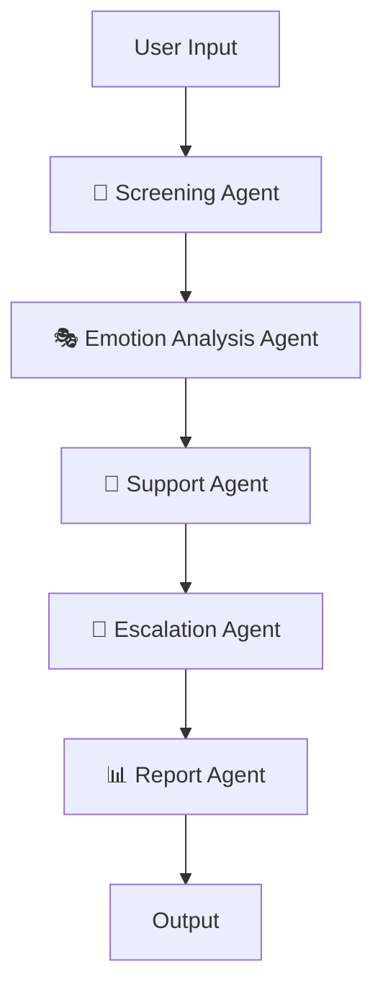

# 🧠 MindCrew: Multi-Agent AI System for Mental Health Screening & Support

> _A compassionate, AI-driven solution for early mental health screening, emotional insight, and virtual support._

[](#)
[](#)
[](LICENSE)

---

<h2>👥 Team Cosmic – IBM SkillsBuild</h2>

<table>
  <tr>
    <td><strong>Kirty Gupta</strong><br>🧠 Agent Architecture</td>
    <td><strong>Vanshika</strong><br>🗣 NLP & Screening</td>
    <td><strong>Rishika Gupta</strong><br>📊 Data & Analysis</td>
  </tr>
  <tr>
    <td><strong>Shlok Arora</strong><br>🧩 System Integration</td>
    <td><strong>Ishant Rajput</strong><br>🚨 Escalation Logic</td>
    <td><strong>Parth Arya</strong><br>📋 Reporting & UI</td>
  </tr>
</table>


---

## 🧩 About the Project

**MindCrew** is a modular, multi-agent AI system designed to:  
✔️ Screen users for early signs of mental health challenges  
✔️ Detect emotions using NLP and transformer models  
✔️ Offer personalized emotional support  
✔️ Flag high-risk responses for escalation  
✔️ Log conversations and generate useful reports  

Built in a **Google Colab environment**, it’s ideal for prototyping and accessible deployment with privacy in mind.

---

## 🎯 Key Objectives

- 🧾 Conduct PHQ-9–based mental health screening  
- 🤖 Detect emotions using transformer-based NLP models  
- 💬 Provide empathetic support based on emotional tone  
- 🚨 Escalate critical responses that may indicate risk  
- 📋 Generate and export session summaries (CSV)

---

## 🛠️ Tech Stack

| Tool / Library | Role |
|----------------|------|
| **Transformers** (`Hugging Face`) | Emotion Classification |
| **Google Colab** | Prototype Development |
| **Pandas** | Data Handling & Reporting |
| **Matplotlib / Seaborn** | Visualizations |
| **CrewAI-Inspired Design** | Multi-Agent Orchestration Pattern |

---

## 🧠 System Architecture



⚙️ Local Setup
```bash
git clone https://github.com/kirtygupta/Mental_Health_Support_AI_Multi_Agent_System.git
cd Mental_Health_Support_AI_Multi_Agent_System
pip install -r requirements.txt
jupyter notebook Mental_Health_Support_AI_Multi_Agent_System.ipynb
```
---
## ✅ Conclusion

MindCrew demonstrates how AI agents can collaboratively simulate a private and scalable mental wellness assistant.
Future work includes:
- Voice input support
- Therapist escalation APIs
- Mobile app deployment

---
## 🌍 Future Enhancements
* 🌐 Multilingual support
* 🎤 Voice input & emotion from audio
* 🧑‍⚕️ Therapist API integration
* 📱 Mobile app version
* 📈 Mood tracking dashboard

---
"Bringing technology and empathy together for a mentally healthier tomorrow." ❤️
